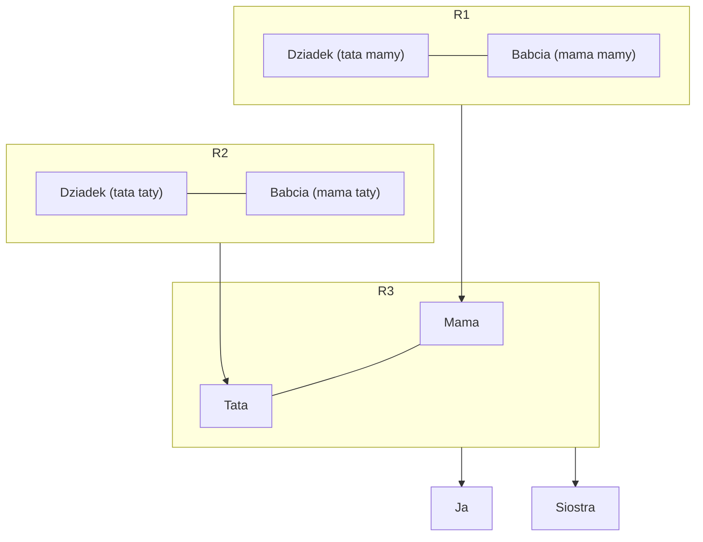

# drzewo

```mermaid
flowchart TB
    %% Pokolenie dziadków
    subgraph R1
        direction LR
        DziadekMM["Dziadek (tata mamy)"]
        BabciaMM["Babcia (mama mamy)"]
        DziadekMM --- BabciaMM
    end    
    subgraph R2
        direction LR
        DziadekMT["Dziadek (tata taty)"]
        BabciaMT["Babcia (mama taty)"]
        DziadekMT --- BabciaMT
    end

    %% Pokolenie rodziców
    subgraph R3
        direction LR
        Mama["Mama"]
        Tata["Tata"]
        Mama --- Tata
    end    
    R1 ---> Mama
    R2 ---> Tata

    %% Wy
    Ja["Ja"]
    R3 ---> Ja
    Siostra["Siostra"]
    R3 ---> Siostra

```