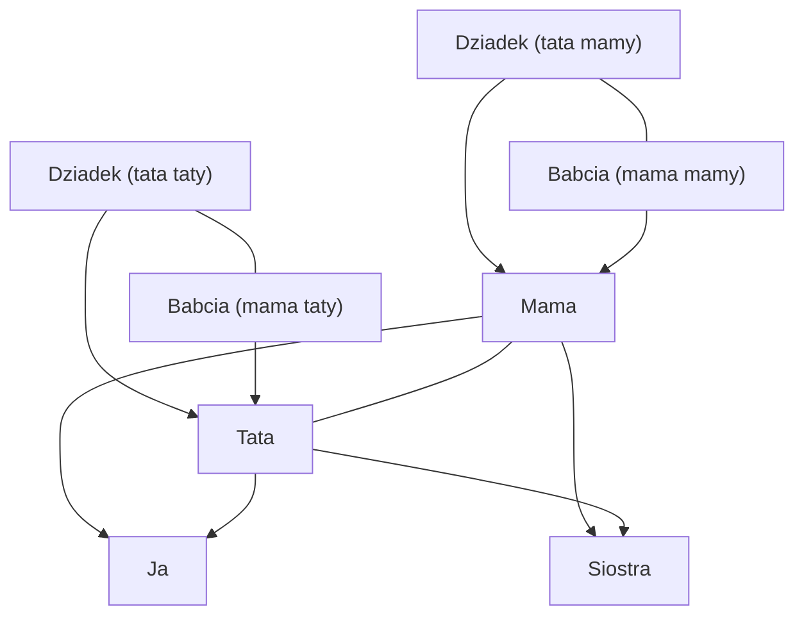

# drzewo

```mermaid
flowchart TB
    %% Pokolenie dziadków
    DziadekMM["Dziadek (tata mamy)"]
    BabciaMM["Babcia (mama mamy)"]
    DziadekMM --- BabciaMM
    DziadekMT["Dziadek (tata taty)"]
    BabciaMT["Babcia (mama taty)"]
    DziadekMT --- BabciaMT

    %% Pokolenie rodziców
    Mama["Mama"]
    DziadekMM --> Mama
    BabciaMM --> Mama
    
    Tata["Tata"]
    DziadekMT --> Tata
    BabciaMT --> Tata

    Mama --- Tata

    %% Wy
    Ja["Ja"]
    Mama --> Ja
    Tata --> Ja
    
    Siostra["Siostra"]
    Mama --> Siostra
    Tata --> Siostra

```