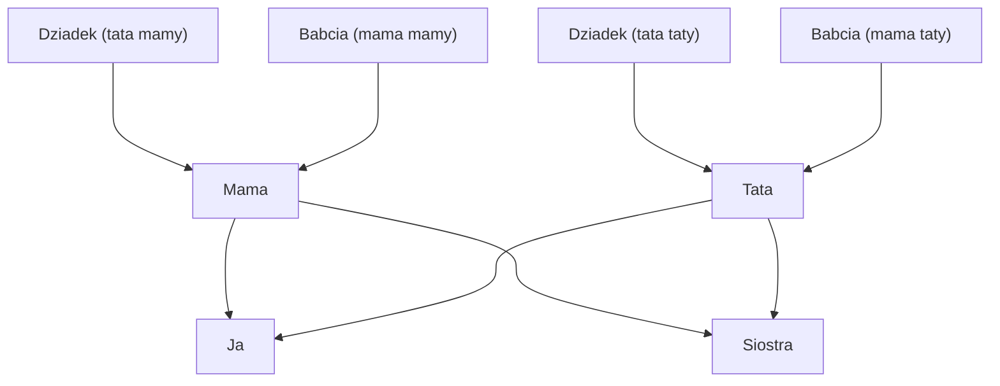

# Wizualizacja drzewa genealogicznego

_Ten plik opisuje projekt w języku polskim. Angielską wersję dokumentacji znajdziesz w pliku [README_EN.md](README_EN.md)._

Projekt generuje **diagram drzewa genealogicznego** z wykorzystaniem narzędzia [Graphviz](https://graphviz.org/). Drzewo jest zdefiniowane w pliku `.dot`, a dołączone skrypty automatyzują proces przygotowania, generowania oraz archiwizacji plików.[file:1]

## Pobierz najnowszą wersję drzewa

Pobierz archiwum z aktualną wersją projektu: [rodzina.7z](rodzina.7z).

## Wymagania

Przed rozpoczęciem pracy upewnij się, że masz zainstalowane:

- **Graphviz** – do pracy z plikami `.dot`.[file:1]
- **bash** – do uruchamiania skryptów powłoki.
- **Przeglądarkę obrazów PNG** – do oglądania wygenerowanego drzewa (`rodzina.png`).

## Użycie

1. **Sklonuj repozytorium i przejdź do katalogu projektu**

   Upewnij się, że jesteś w katalogu projektu (np. `/mnt/e/repo/drzewo/`).

```bash
cd /mnt/e/repo/drzewo/
```

2. **Utwórz plik `pass.txt` z hasłem**

```bash
touch pass.txt
```


Plik `pass.txt` jest używany przez skrypty do obsługi hasła (np. podczas archiwizacji).

3. **Przygotuj pliki do pracy**

```bash
./makeReadyToWork.sh rodzina
```

Skrypt przygotowuje środowisko pracy, np. czyści stare wyniki lub tworzy odpowiednie kopie plików.

4. **Wygeneruj obraz PNG z pliku DOT**

```bash
dot -Tpng ./rodzina.dot -o rodzina.png
```

Polecenie wykorzystuje Graphviz do przekształcenia opisu drzewa (`.dot`) w obraz PNG.[file:1]

5. **Zarchiwizuj projekt**

```bash
./arch.sh rodzina
```

Skrypt tworzy archiwum (np. do backupu lub udostępnienia aktualnej wersji drzewa).

## Wynik

Po wykonaniu kroków 3–4 otrzymasz:

- Plik `rodzina.png` przedstawiający aktualne drzewo genealogiczne.
- Przygotowany projekt, który można zarchiwizować (krok 5) i bezpiecznie przechowywać lub udostępniać.

## Uwagi

- Plik `.dot` możesz dowolnie modyfikować, aby dodawać, usuwać lub zmieniać osoby oraz relacje w drzewie.
- Skrypty `makeReadyToWork.sh` oraz `arch.sh` można dostosować do innych nazw plików lub struktury katalogów, jeśli projekt będzie rozbudowywany.

# Bonus: przykład grafu z mermaid 
