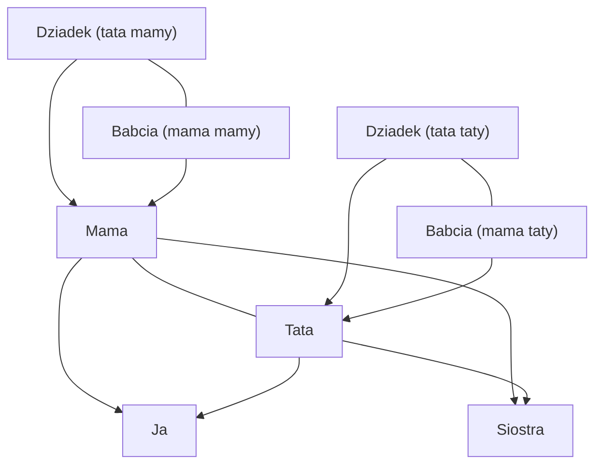

# drzewo

```mermaid
flowchart TB
    %% Pokolenie dziadków mamy
    DziadekMM["Dziadek (tata mamy)"]
    BabciaMM["Babcia (mama mamy)"]

    %% Pokolenie dziadków taty
    DziadekMT["Dziadek (tata taty)"]
    BabciaMT["Babcia (mama taty)"]

    %% Pokolenie rodziców
    Mama["Mama"]
    Tata["Tata"]

    %% Wy
    Ja["Ja"]
    Siostra["Siostra"]

    %% Relacje małżeńskie (poziome)
    DziadekMM --- BabciaMM
    DziadekMT --- BabciaMT
    Mama --- Tata

    %% Rodzice mamy -> mama
    DziadekMM --> Mama
    BabciaMM --> Mama

    %% Rodzice taty -> tata
    DziadekMT --> Tata
    BabciaMT --> Tata

    %% Rodzice -> dzieci (Wy)
    Mama --> Ja
    Tata --> Ja

    Mama --> Siostra
    Tata --> Siostra

```