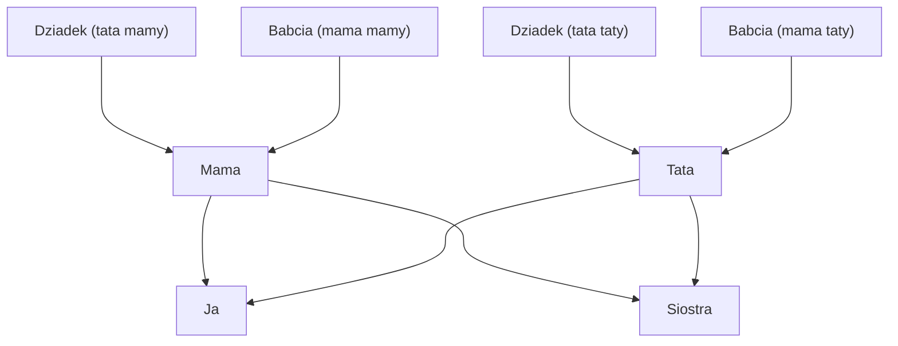

# drzewo

```mermaid
flowchart TB
    %% Pokolenie dziadków
    DziadekMM["Dziadek (tata mamy)"] & BabciaMM["Babcia (mama mamy)"] ---> Mama["Mama"]
    DziadekMT["Dziadek (tata taty)"] & BabciaMT["Babcia (mama taty)"] ---> Tata["Tata"]

    %% Pokolenie rodziców
    Mama & Tata ---> Ja["Ja"]
    Mama & Tata ---> Siostra["Siostra"]
    
    click Ja "[Ja](people/ja.md)" _blank

```