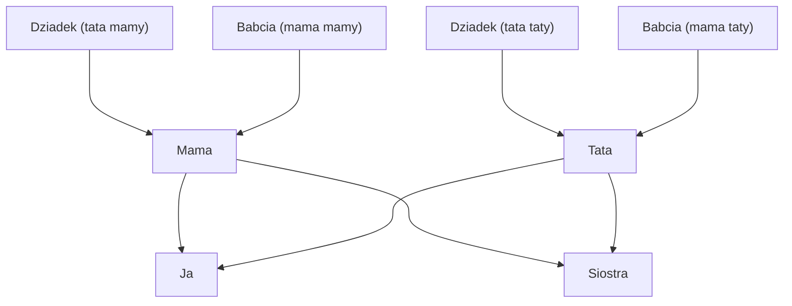

# Family Tree Visualization

_This file describe project in English. You can find Polish version under the file [README.md](README.md)._

This project generates a **family tree diagram** using [Graphviz](https://graphviz.org/). The `.dot` file defines family members and relationships, and the included scripts automate the generation and archiving process.

## Get the latest version of the tree

Download [rodzina.7z](rodzina.7z)

## Requirements

Before using this project, make sure you have the following installed:

- **Graphviz** (for working with `.dot` files)
- **bash** (to run shell scripts)
- **png viewer** (to view the generated image)

## Usage

1. **Clone the repo and go to the project directory**

2. **Create `pass.txt` file with password**

```bash
touch pass.txt
```

3. **Prepare files for work:**

```bash
./makeReadyToWork.sh rodzina
```

4. **Generate a PNG image from the DOT file:**

```bash
dot -Tpng ./rodzina.dot -o rodzina.png
```

5. **Archive the project:**

```bash
./arch.sh rodzina
```

## Output

After running the above commands (3,4), you’ll have:

- A `rodzina.png` image showing your family tree.
- A prepared and archived project ready for backup or sharing.

## Notes

- You can customize the `.dot` file to add, remove, or modify family members and relationships.
- The `makeReadyToWork.sh` and `arch.sh` scripts can be adapted for different filenames or directory structures.


# Bonus: mermaid example
