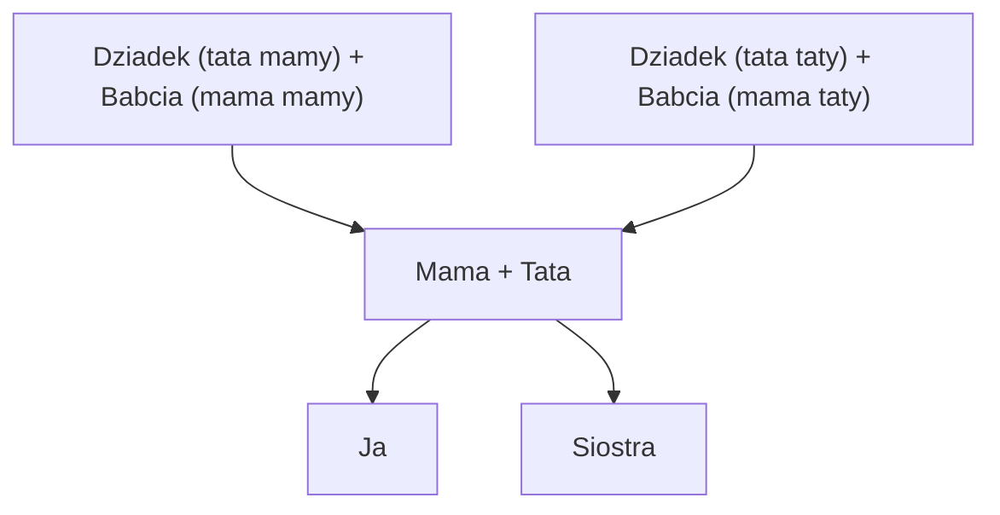

# drzewo

```mermaid
flowchart TB
    %% Pokolenie dziadków
    DziadekMM_BabciaMM["Dziadek (tata mamy) + Babcia (mama mamy)"]
    DziadekMT_BabciaMT["Dziadek (tata taty) + Babcia (mama taty)"]

    %% Pokolenie rodziców
    Mama_Tata["Mama + Tata"]
    DziadekMM_BabciaMM --> Mama_Tata
    DziadekMT_BabciaMT --> Mama_Tata

    %% Wy
    Ja["Ja"]
    Mama_Tata --> Ja
    Siostra["Siostra"]
    Mama_Tata --> Siostra
```